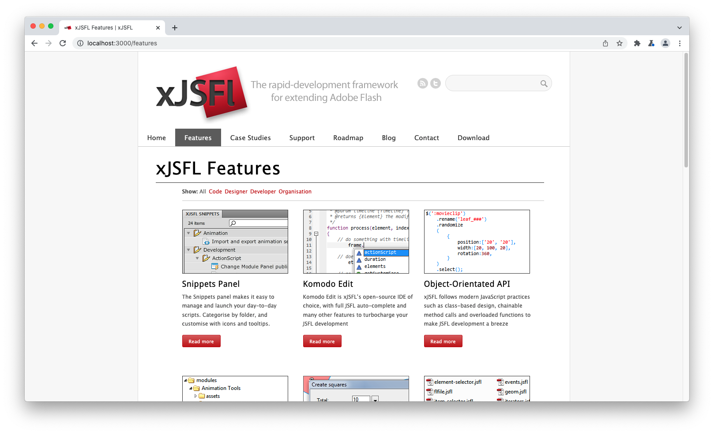

# xJSFL Site
## Intro

This is an exported, static version of the old WordPress site for [xJSFL](https://github.com/davestewart/xjsfl):



Rather than running on a traditional web host, it is now served statically by Vercel, making it faster and more secure – at the expense of a forum and being able to leave comments.

As very few people still use JSFL/xJSFL this isn't really an issue but rather than delete the site forever, I wanted some way to keep the docs available.

## Access

### Online

Visit the site at [xjsfl.com](https://xjsfl.com). 

### Offline

Clone or download this repo then serve using your preferred method ([npx](https://nodejs.dev/learn/the-npx-nodejs-package-runner) is simple if you have Node installed):

```bash
npx serve site
```

Then access the site at the URL shown in the terminal, usually:

- http://localhost:3000
